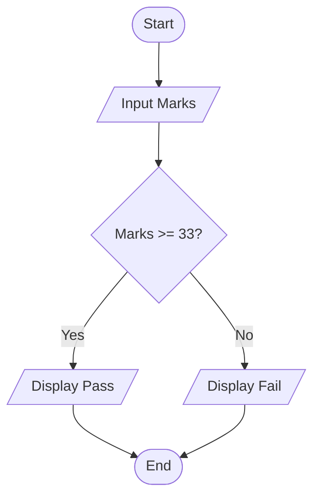
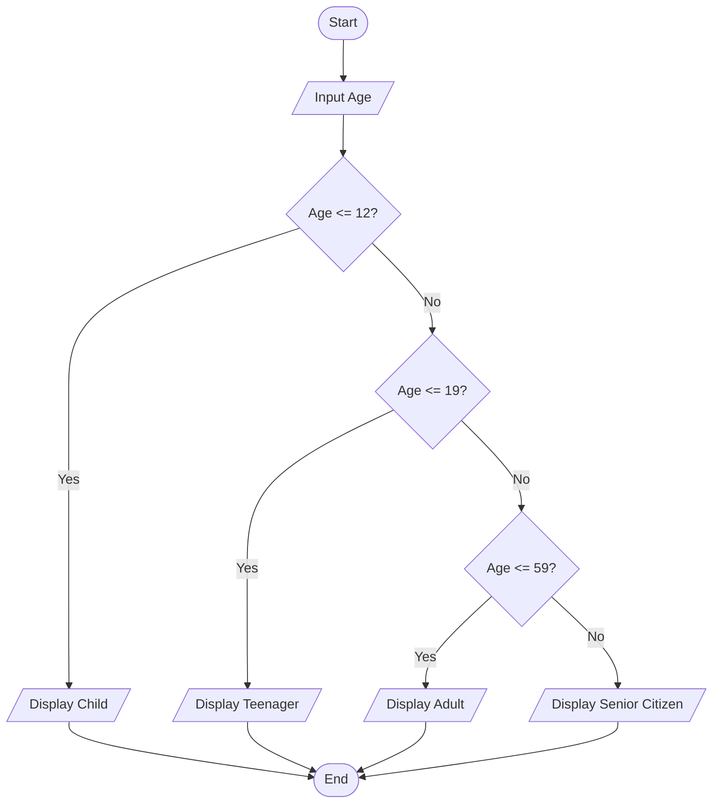
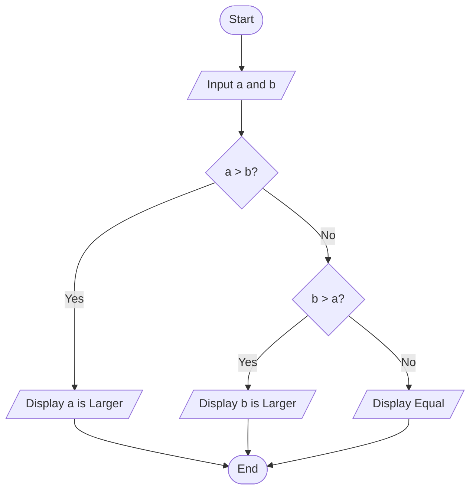
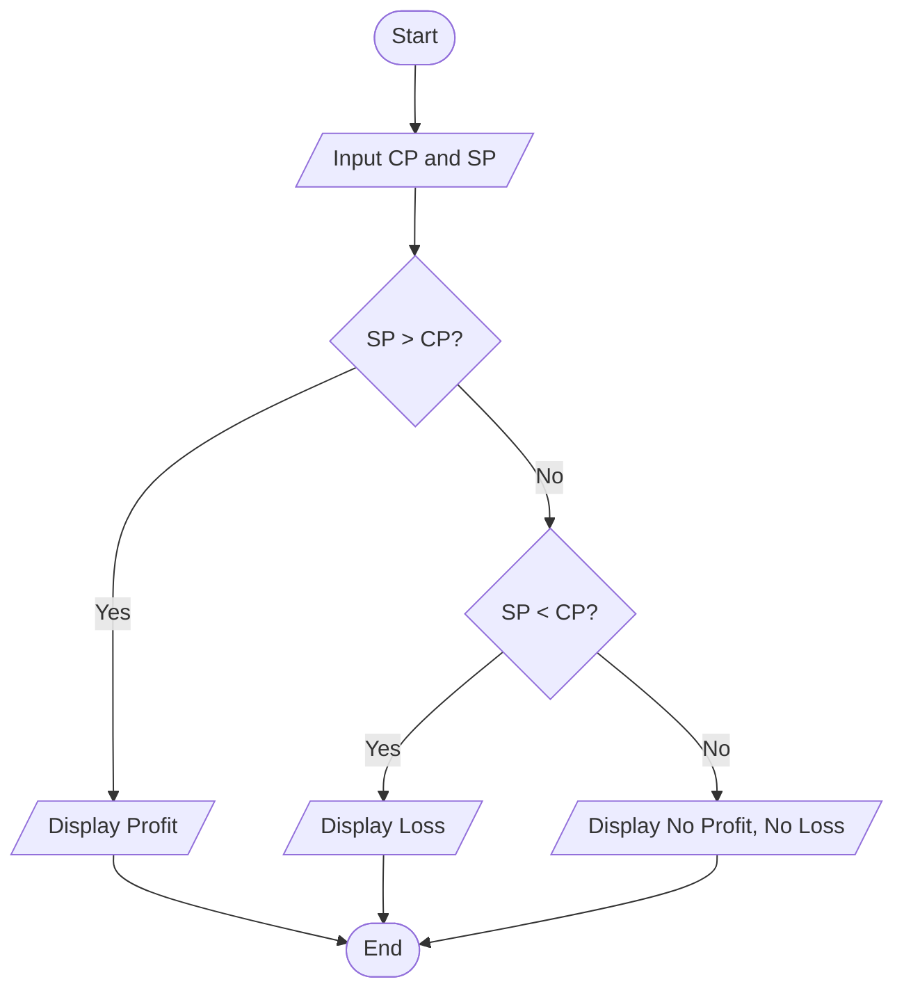
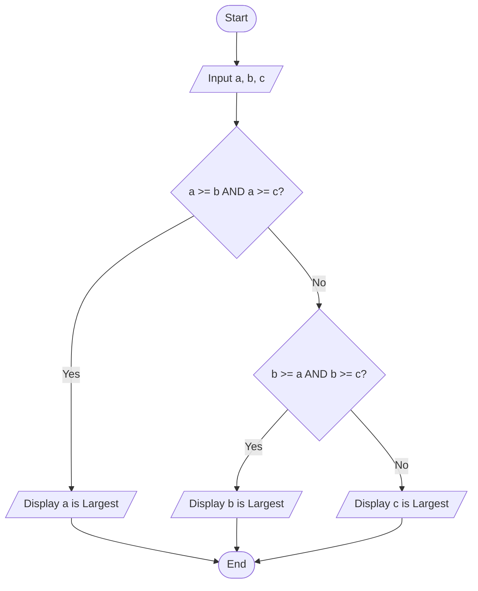

# algorithm-flowchart-practice
This repository contains beginner-level C programming practice, algorithms, flowcharts, and problem-solving exercises. 
# 📘 Algorithm & Flowchart Practice — Set 02

## 📚 Problems

1. Student Marks — Pass or Fail
2. Age Classification
3. Compare Two Numbers
4. Profit, Loss, or No Profit No Loss
5. Largest Among Three Numbers

---

## 01. Student Marks — Pass or Fail

**Problem:**  
Input a student's marks and display **Pass** if the marks are 33 or above; otherwise display **Fail**.

### Algorithm

1. Start
2. Input student's marks
3. Check whether `marks >= 33`
4. If true, display **Pass**
5. Otherwise, display **Fail**
6. End

### Flowchart

---

## 02. Age Classification

**Problem:**  
Input a person's age and display **Child** for ages 0–12, **Teenager** for ages 13–19, **Adult** for ages 20–59, and **Senior Citizen** for ages 60 or above.

### Algorithm

1. Start
2. Input age
3. If `age <= 12`, display **Child**
4. Otherwise, if `age <= 19`, display **Teenager**
5. Otherwise, if `age <= 59`, display **Adult**
6. Otherwise, display **Senior Citizen**
7. End

### Flowchart

---

## 03. Compare Two Numbers

**Problem:**  
Input two numbers and determine which number is larger. If both numbers are equal, display **Equal**.

### Algorithm

1. Start
2. Input two numbers `a` and `b`
3. Check whether `a > b`
4. If true, display **a is Larger**
5. Otherwise, check whether `b > a`
6. If true, display **b is Larger**
7. Otherwise, display **Equal**
8. End

### Flowchart

---

## 04. Profit, Loss, or No Profit No Loss

**Problem:**  
Input the Cost Price and Selling Price of a product and determine whether there is **Profit, Loss, or No Profit No Loss**.

### Algorithm

1. Start
2. Input Cost Price `CP`
3. Input Selling Price `SP`
4. If `SP > CP`, display **Profit**
5. Otherwise, if `SP < CP`, display **Loss**
6. Otherwise, display **No Profit, No Loss**
7. End

### Flowchart

---

## 05. Largest Among Three Numbers

**Problem:**  
Input three numbers and determine the largest among them. The program should also handle cases where two or more numbers are equal.

### Algorithm

1. Start
2. Input three numbers `a`, `b`, and `c`
3. Check whether `a >= b` and `a >= c`
4. If true, display **a is Largest**
5. Otherwise, check whether `b >= a` and `b >= c`
6. If true, display **b is Largest**
7. Otherwise, display **c is Largest**
8. End

### Flowchart

---

## Concepts Practiced — Set 02

- Variables
- Input and Output
- Comparison Operators
- Relational Operators
- `if-else`
- Nested Conditions
- Logical Operators
- `&&` (AND)
- `>=` (Greater Than or Equal)
- `>` (Greater Than)
- `<` (Less Than)
- Basic Decision Making
- Algorithms
- Flowcharts
- Problem Solving

---

## Learning Goal

To improve my logical thinking, decision-making, algorithm design, and flowchart skills through C programming practice.

> Practice Set 02 — Building stronger problem-solving skills step by step. 
